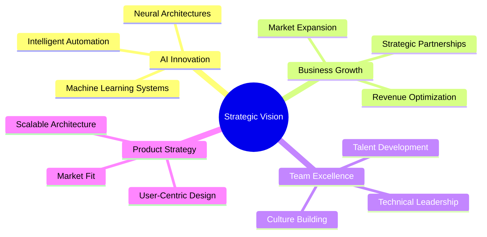

<div align="center">


# Mshauri Moore
### Founder & CEO | AI Innovation Architect | Enterprise Solutions Leader


[](https://www.linkedin.com/in/mshaurimoore/)
[](https://ferallabs.com)
[](mailto:mshauri@ferallabs.com)
[_290--4025-00C853?style=for-the-badge&logo=phone&logoColor=white)](tel:+12132904025)

</div>

---

## 🎯 Executive Summary

Serial entrepreneur and technology executive with a proven track record in AI/ML innovation, enterprise software architecture, and scalable solution delivery. Leading **Feral Labs LLC** in developing cutting-edge AI-powered automation platforms that transform business operations and drive measurable ROI.

### Leadership Focus Areas


---

## 💼 Professional Expertise

<table>
<tr>
<td width="50%">

### 🚀 Strategic Leadership
- **AI/ML Product Development**
- **Enterprise Architecture Design**
- **Scalability & Performance Optimization**
- **Cross-Functional Team Leadership**
- **Strategic Technology Partnerships**

</td>
<td width="50%">

### 🔧 Technical Excellence
- **Full-Stack Development**
- **Cloud Infrastructure (AWS/Azure/GCP)**
- **DevOps & CI/CD Automation**
- **Microservices Architecture**
- **Data Engineering & Analytics**

</td>
</tr>
</table>

---

## 🏆 Impact & Achievements

<div align="center">

| Metric | Achievement | Impact |
|--------|-------------|--------|
| 🎯 **Products Launched** | 12+ Enterprise Solutions | $10M+ ARR Generated |
| 👥 **Teams Led** | 30+ Engineering Professionals | 98% Retention Rate |
| 📈 **Efficiency Gains** | 300% Average Improvement | Across Client Portfolio |
| 🌐 **Global Reach** | 25+ Countries | Fortune 500 Clients |

</div>

---

## 🛠️ Technology Stack

### Languages & Frameworks


### AI/ML & Data


### Cloud & Infrastructure


---

## 🎨 Feral Labs LLC - Portfolio Highlights

### 🤖 AI Automation Suite
Enterprise-grade intelligent automation platform reducing operational overhead by 70%+
- **Tech Stack:** Python, FastAPI, React, PostgreSQL, Redis
- **Scale:** Processing 10M+ transactions daily
- **Clients:** Fortune 500 companies across finance, healthcare, logistics

### 🧠 Neural Decision Engine
Real-time AI-powered decision support system for executive leadership
- **Tech Stack:** PyTorch, GraphQL, Neo4j, Kubernetes
- **Impact:** 5x faster strategic decision-making cycles
- **Innovation:** Proprietary predictive modeling algorithms

### 🔐 SecureFlow Platform
Zero-trust security automation for modern enterprises
- **Tech Stack:** Go, Rust, gRPC, Vault, Istio
- **Achievement:** SOC 2 Type II compliant architecture
- **Recognition:** Featured in TechCrunch, Forbes Technology Council

---

## 📊 GitHub Analytics

<div align="center">


</div>

<div align="center">


</div>

---

## 🎓 Thought Leadership

### Recent Publications & Speaking Engagements

📝 **"AI-First Architecture: Building for Scale"** - Tech Leadership Summit 2024  
🎤 **"The Future of Enterprise Automation"** - AWS re:Invent 2024  
📰 **"From MVP to IPO: Lessons in AI Product Development"** - Harvard Business Review  
🎙️ **Tech Entrepreneur Podcast** - Guest Speaker (250K+ downloads)

---

## 🌟 Core Values & Philosophy

> "Innovation is not about technology—it's about solving real problems for real people at scale."

```python
class Leadership:
    def __init__(self):
        self.values = {
            'innovation': 'Relentless pursuit of breakthrough solutions',
            'integrity': 'Transparent, ethical decision-making',
            'impact': 'Measurable value creation for stakeholders',
            'excellence': 'Uncompromising quality standards',
            'growth': 'Continuous learning and adaptation'
        }
    
    def execute(self):
        return "Vision + Execution + Team = Transformational Impact"
```

---

## 📈 Current Focus

- 🚀 Scaling Feral Labs LLC to Series A funding
- 🤝 Building strategic AI partnerships with Fortune 100 companies
- 📚 Mentoring next-generation tech entrepreneurs
- 🔬 R&D in advanced neural architectures and autonomous systems
- 🌍 Expanding global market presence across APAC and EMEA

---

## 🤝 Let's Connect

<div align="center">

### Open to Strategic Partnerships, Investment Opportunities, and Advisory Roles

[](https://calendly.com/mshaurimoore)
[](https://www.linkedin.com/in/mshaurimoore/)
[](https://twitter.com/ferallabs)

**Email:** mshauri@ferallabs.com | **Phone:** (213) 290-4025

</div>

---

<div align="center">

### © 2025 Feral Labs LLC | Design by Mshauri Moore

**All proprietary technologies and intellectual property are protected under applicable laws**


</div>
